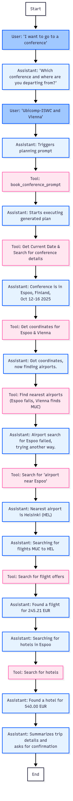

# Conference Trip Planning Conversation Summary

This document summarizes the conversation with the AI assistant for planning a trip to the Ubicomp-ISWC conference.

## Conversation Flow

1.  **User:** "i want to go to a conference"
2.  **Assistant:** Asks for conference name and departure city.
3.  **User:** "Ubicomp-ISWC and Vienna"
4.  **Assistant:** Acknowledges the user's request, which triggers the planning prompt.

    *   **Tool Call:** `book_conference_prompt(conferenceName="Ubicomp-ISWC", departureCity="Vienna")`
        *   **Result:** A detailed plan was generated for the assistant to follow.
5.  **Assistant:** Acknowledges the user's request and starts planning.

    *   **Tool Call:** `mcp_conference_get_current_date()`
        *   **Result:** The current date was retrieved.
    *   **Tool Call:** `mcp_brightdata-mcp_search_engine(query="Ubicomp-ISWC conference date and location")`
        *   **Result:** Found that Ubicomp/ISWC 2025 will be held in Espoo, Finland from October 12-16, 2025.

6.  **Assistant:** Relays conference details and proceeds to find coordinates for the locations.

    *   **Tool Call:** `mcp_conference_get_coordinates(address="Espoo, Finland")`
        *   **Result:** Retrieved coordinates for Espoo (Latitude: 60.2054911, Longitude: 24.6559001).
    *   **Tool Call:** `mcp_conference_get_coordinates(address="Vienna")`
        *   **Result:** Retrieved coordinates for Vienna (Latitude: 48.2080696, Longitude: 16.3713095).

7.  **User:** "go on"
8.  **Assistant:** Confirms receipt of coordinates and moves to find nearby airports.

    *   **Tool Call:** `mcp_amadeus-booking-mcp_get_nearest_airports(latitude=60.2054911, longitude=24.6559001)`
        *   **Result:** Failed to find a relevant airport for Espoo using coordinates.
    *   **Tool Call:** `mcp_amadeus-booking-mcp_get_nearest_airports(latitude=48.2080696, longitude=16.3713095)`
        *   **Result:** Found Munich International Airport (MUC) as the most relevant for Vienna.

9.  **Assistant:** Informs the user about the airport issue for Espoo and plans to search differently.

    *   **Tool Call:** `mcp_brightdata-mcp_search_engine(query="airport near Espoo, Finland")`
        *   **Result:** Found Helsinki-Vantaa Airport (HEL) is the nearest airport to Espoo.

10. **Assistant:** Confirms the airport for Espoo and proceeds to search for flights.

    *   **Tool Call:** `mcp_amadeus-booking-mcp_search_flight_offers(adults=1, departureDate="2025-10-11", destinationLocationCode="HEL", originLocationCode="MUC", returnDate="2025-10-17")`
        *   **Result:** Found a non-stop Lufthansa flight for 245.21 EUR.

11. **Assistant:** Presents the flight option and moves on to find a hotel.

    *   **Tool Call:** `mcp_amadeus-booking-mcp_search_hotels_by_geocode(adults=1, checkInDate="2025-10-11", checkOutDate="2025-10-17", latitude=60.2054911, longitude=60.2054911, longitude=24.6559001)`
        *   **Result:** Found several hotels, with the cheapest being "TEST HOTEL" for 540.00 EUR including breakfast.

12. **Assistant:** Summarizes all the gathered trip details (conference, flight, hotel) and asks the user for confirmation to book.

## Possible Extensions

Based on the use case, here are several ways the system could be extended, categorized by the type of change required:

### Current MCP-Server/Tools
These extensions represent adjustments to the existing tools and planning logic.

*   **Multi-Conference Planning:** Handle booking for a series of upcoming conferences (e.g., ISWC, ESWC, The Web Conf), not just one.
*   **Budgetary and Location Constraints:** Apply stricter hotel search filters, such as a maximum distance from the venue and a nightly budget (e.g., <150 EUR).
*   **Smarter Itinerary Timing:** Automatically adjust travel dates based on location (e.g., arrive a day early for intercontinental flights) and conference-end times.

### Additional MCP-Server/Tools
These extensions would require adding new tools, integrations, or core server capabilities.

*   **Calendar/Schedule Integration:** Connect to personal calendars and university course repositories to ensure travel does not conflict with existing appointments or teaching schedules.
*   **University System Integration:** Automate administrative tasks, such as filing for "research absences" directly in the university's internal system.
*   **Deadline Tracking:** Add a tool to find and monitor conference registration deadlines to take advantage of early-bird pricing.
*   **Automated Registration:** Beyond booking travel, handle the conference registration process itself, including selecting rates like "academic."
*   **Advanced Travel Preferences:** Prioritize train travel over flights where practical, which would require a new tool for searching train routes, including night trains.
*   **Financial Management:** Manage travel expenses against a monthly credit card limit to avoid overspending and schedule bookings accordingly.
